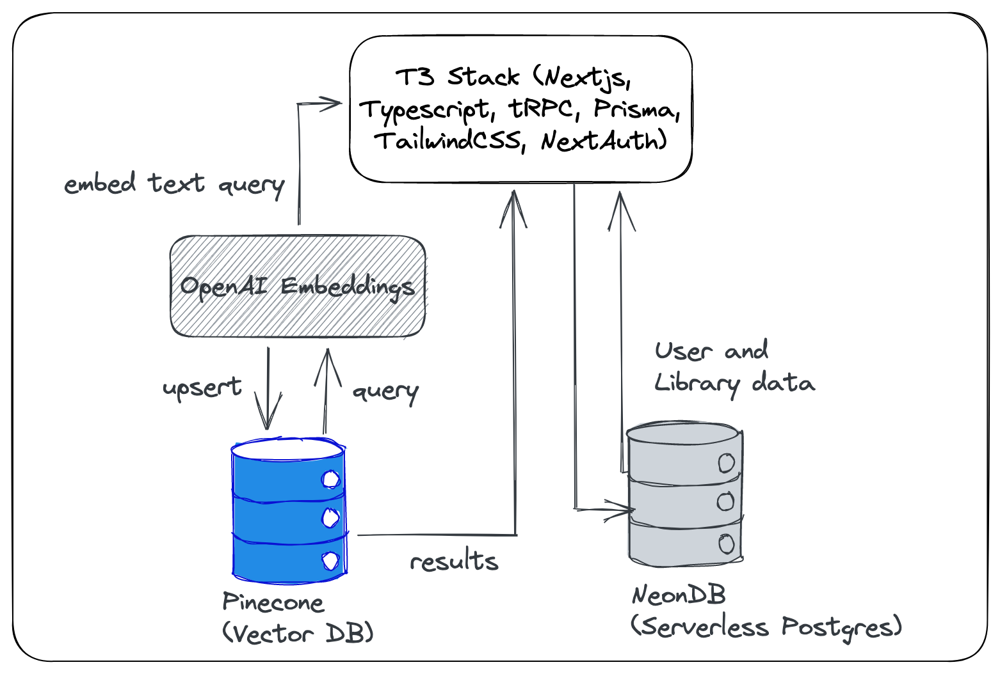
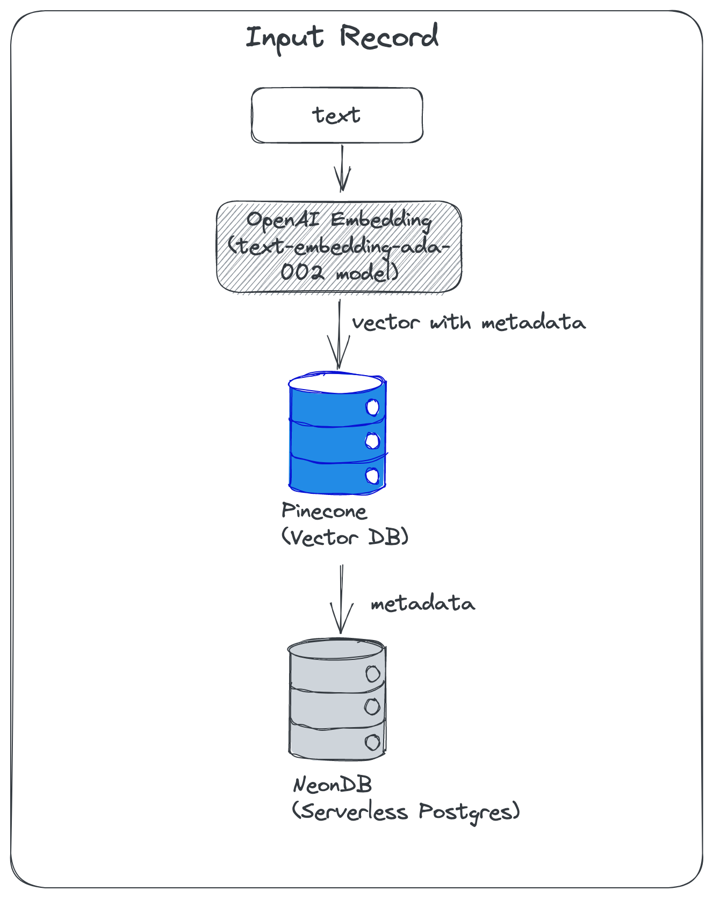
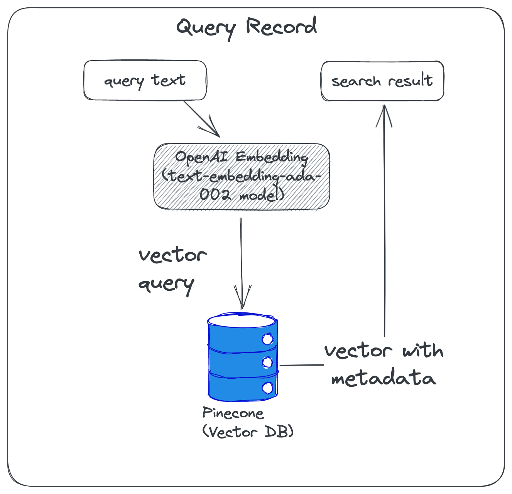

# Semantic Search with OpenAI Embeddings and Pinecone

Demo link: https://semantic-search.mharrvic.com
Repo link: [https://github.com/mharrvic/semantic-search-openai-pinecone](https://github.com/mharrvic/semantic-search-openai-pinecone)

This is a demo app that shows how to use [OpenAI Embeddings](https://beta.openai.com/docs/guides/embeddings) and [Pinecone](https://pinecone.io) vector database to build a semantic search engine. Based on https://docs.pinecone.io/docs/semantic-text-search. You can run explore this freely using the free tier of Pinecone and OpenAI.

## Tech Stack

- [Next.js](https://nextjs.org)
- [NextAuth.js](https://next-auth.js.org)
- [Prisma](https://prisma.io)
- [Tailwind CSS](https://tailwindcss.com)
- [tRPC](https://trpc.io)
- [Pinecone vector db](https://pinecone.io)
- [OpenAI Embeddings](https://beta.openai.com/docs/guides/embeddings)
- [NeonDB serverless postgres db](neon.tech)

## Demo Video

https://user-images.githubusercontent.com/15852818/209995984-25fefed6-956c-4c8e-90c5-e5a3db310c29.mp4

https://user-images.githubusercontent.com/15852818/209996939-06a97708-7bed-4a8e-997a-7df99523727c.mp4

## Learn More

## Input record

### Query

I recommend to watch this [youtube video](https://www.youtube.com/watch?v=5MaWmXwxFNQ) from AssemblyAI to learn more about embeddings.
